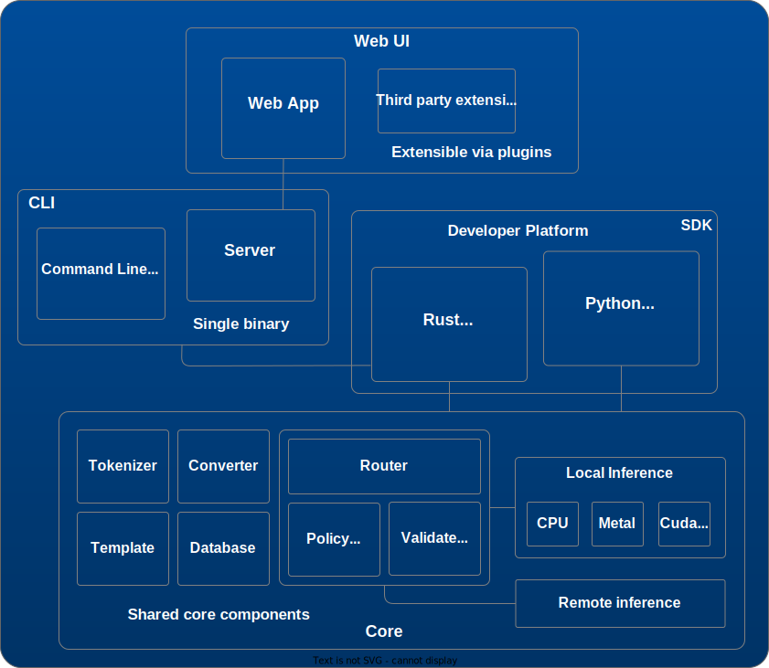

# Talu

**Inference Runtime for Local and Remote Models.**

Talu is an inference-first runtime built in Zig. Download models from HuggingFace, optionally quantize them, and run inference from the CLI, Rust/Python bindings, or the HTTP server.

It supports local inference and routing to remote OpenAI-compatible providers through the same core runtime and protocol surfaces.

- **CLI** — download, quantize, chat, serve, and inspect models
- **Python API** — sync and async, multi-turn chat, streaming, embeddings, tool calling, hooks
- **HTTP server** — OpenResponses-compatible API + Chat Completions + model/tokenizer endpoints
- **Structured output** — precompiled grammars with streaming validation
- **Quantization** — built-in 4-bit and 8-bit grouped affine schemes
- **Backends** — CPU and Metal (CUDA planned); local models and remote OpenAI-compatible endpoints

## Install

```bash
pip install talu
```

Requires Python 3.10+.

## Quick Start (CLI)

### Download and list cached models

```bash
talu get LiquidAI/LFM2-350M
talu ls
```

### Ask a question directly with `-m`

```bash
talu ask -m LiquidAI/LFM2-350M "What is 2+2?"
```

### Set a default model so `-m` is optional

```bash
talu set LiquidAI/LFM2-350M
talu set show
talu ask "Tell me a short joke."
```

### Use implicit `ask` mode (stdin)

When no subcommand is provided, talu implicitly runs `ask`.

```bash
# Equivalent to: talu ask -m LiquidAI/LFM2-350M "hello"
echo "hello" | talu -m LiquidAI/LFM2-350M

# Equivalent to: talu ask "hello"
echo "hello" | talu
```

For multimodal models, piped image bytes are treated as an image input. If no
text prompt is provided, talu uses `Describe this image.` automatically.

```bash
cat test.jpeg | talu ask -m Qwen/Qwen3-VL-2B-Instruct
cat test.jpeg | talu ask -m Qwen/Qwen3-VL-2B-Instruct "What objects are visible?"
```

### Quantize a model

```bash
talu convert LiquidAI/LFM2-350M
talu set LiquidAI/LFM2-350M-TQ4
talu ask "Explain quantization in one sentence."
```

Converts the model to 4-bit (default scheme: `nvfp4`). Converted models are saved with a `-NVFP4` suffix; the original remains available.

Available schemes (Talu Quantized):

| Scheme | Description |
|---|---|
| `tq4` | 4-bit, group 32 — highest accuracy, largest (default) |
| `tq4_64` | 4-bit, group 64 — balanced |
| `tq4_128` | 4-bit, group 128 — smallest 4-bit |
| `tq8_32` | 8-bit, group 32 — near-original quality |
| `tq8` | 8-bit, group 64 |
| `tq8_128` | 8-bit, group 128 |

4-bit reduces model size ~4x with some quality loss. 8-bit preserves more quality at ~2x reduction. Smaller group sizes improve accuracy but increase file size.

### Start the HTTP server

```bash
talu serve
```

By default, the server listens on `http://127.0.0.1:8258`:
- Console UI: `http://127.0.0.1:8258/`
- OpenResponses-compatible API: `http://127.0.0.1:8258/v1`
- Override host/port: `talu serve --host 0.0.0.0 --port 9000`

API compatibility target: [OpenResponses](https://openresponses.org).

More at [docs.talu.dev](https://docs.talu.dev).

## Script/CI Flow

For machine-friendly stdout contracts, use the CLI output flags:

```bash
MODEL_URI=$(talu get --model-uri LiquidAI/LFM2-350M)
CONVERTED_URI=$(talu convert --model-uri "$MODEL_URI")
SET_URI=$(talu set --model-uri "$CONVERTED_URI")
SESSION_ID=$(talu ask --session-id "Start incident analysis")
talu ask --session "$SESSION_ID" -q "List likely causes"
```

See `examples/cli/README.md` for broader interactive and CI patterns.

## Python

Basic chat:

```python
from talu import Chat

chat = Chat("LiquidAI/LFM2-350M", system="You are helpful.")
response = chat("What is the capital of France?")
print(response)

response = response.append("Now answer in one sentence.")
print(response)
```

Shared client for multiple chats:

```python
from talu import Client

client = Client("LiquidAI/LFM2-350M")
alice = client.chat(system="You are concise.")
bob = client.chat(system="You are detailed.")

print(alice("Explain recursion."))
print(bob("Explain recursion."))
client.close()
```

Persistent sessions via external `TALU_DB_HOST`:

```python
import os
import talu

os.environ["TALU_DB_HOST"] = "localhost:7258"
chat = talu.Chat("LiquidAI/LFM2-350M")
chat("Draft release notes.", stream=False)
```

Python docs: `bindings/python/README.md`

## Key Commands

| Command | Purpose |
|---|---|
| `talu get <model>` | Download/cache a model |
| `talu ls` | List cached models |
| `talu ls <model>` | List files for one cached model |
| `talu set <model>` | Set default model |
| `talu set show` | Show default model configuration |
| `talu ask ...` | Ask a model |
| `talu convert <model> ...` | Quantize a model |
| `talu rm <model>` | Remove a cached model |
| `talu tokenize <model> "text"` | Inspect tokenization |
| `talu serve` | Start chat HTTP server + OpenResponses API (default: `127.0.0.1:8258`) |

## Persistence

- Local runtime is inference-first and stateless.
- Chat/session persistence is externalized through `TALU_DB_HOST` (`v1/chat` API).
- Use the same `TALU_DB_HOST` for both `talu ask` and Talupi UI to share transcripts.

## Architecture

Talu is organized as one inference/runtime core with thin interface layers:

- `core/`: Zig inference engine and C API boundary (`core/src/capi/`)
- `bindings/python/`: Python package (`import talu`)
- `bindings/rust/talu-sys/`: generated low-level Rust FFI bindings
- `bindings/rust/talu/`: safe Rust API over FFI
- `bindings/rust/cli/`: CLI and HTTP server (OpenResponses-compatible API)

Request flow:

```text
CLI / Python / HTTP clients
       |
       v
Surface layer (CLI, Python binding, or HTTP server)
       |
       v
Rust safe wrapper / C API boundary
       |
       v
Core Zig runtime (model + inference)
       |
       v
Local model cache + external optional persistence (`TALU_DB_HOST`)
```

## Repository Layout

```text
core/               Zig inference engine + C API
bindings/python/    Python package
bindings/rust/      Rust FFI, safe wrapper, CLI/server
docs/               Documentation site source
examples/           Runnable CLI/Python/server examples
```

## Supported Models

Models are downloaded from HuggingFace on first use. The models below have been verified. Other sizes and variants based on the same architecture are expected to work as well. This list is updated as coverage expands — the objective is to support all major model architectures (see [Roadmap](#roadmap)).

**Qwen**
- `Qwen/Qwen3-0.6B`
- `Qwen/Qwen3-1.7B`
- `Qwen/Qwen3-4B`

**LLaMA**
- `meta-llama/Llama-3.2-1B`
- `meta-llama/Llama-3.2-1B-Instruct`

**Mistral**
- `mistralai/Ministral-3B-Instruct`

**Gemma**
- `google/gemma-3-270m-it`
- `google/gemma-3-1b-it`

**Phi**
- `microsoft/Phi-3-mini-128k-instruct`
- `microsoft/Phi-3.5-mini-instruct`
- `microsoft/Phi-4-mini-instruct`
- `microsoft/Phi-4-mini-reasoning`

**Granite**
- `ibm-granite/granite-4.0-h-350m`
- `ibm-granite/granite-4.0-micro`

**LFM**
- `LiquidAI/LFM2-350M`
- `LiquidAI/LFM2-1.2B`
- `LiquidAI/LFM2-2.6B`
- `LiquidAI/LFM2.5-1.2B-Instruct`
- `LiquidAI/LFM2.5-1.2B-Thinking`

## Build from Source

Requires [Zig 0.15.2](https://ziglang.org/download/), [Cargo (Rust)](https://www.rust-lang.org/tools/install), [Bun](https://bun.sh/), and [uv](https://docs.astral.sh/uv/). CMake is only needed for macOS MLX source builds.

```bash
git clone https://github.com/aprxi/talu.git
cd talu
make
```

`make` builds:
- CLI binary: `./zig-out/bin/talu`
- Native Python library:
  - Linux: `bindings/python/talu/libtalu.so`
  - macOS: `bindings/python/talu/libtalu.dylib`

This source build does not produce a Python wheel/package.

## Python Package Build (Short Version)

For a local package build with a timestamped `post` version:

```bash
cd bindings/python
make build
```

If native artifacts are missing (for example after `make clean` at repo root), this target bootstraps the required root build automatically.

Artifacts are written to `bindings/python/dist/` as:
- `talu-<base>.post<timestamp>.tar.gz`
- `talu-<base>.post<timestamp>-py3-none-any.whl`

Optional: set `BUILD_TS` for reproducible local version stamps, e.g. `make build BUILD_TS=202602121015`.

## Roadmap
This blueprint outlines the major components of the project and how they fit together. It serves as a shared high-level reference for the system’s structure and direction.

Development follows this structure: the architecture evolves incrementally while individual subsystems are expanded and refined. Features are introduced progressively, and implementation depth varies across components.

The roadmap below highlights the primary areas of focus for upcoming releases. In parallel, we continue ongoing work on bug fixes, performance improvements, compatibility updates, and documentation.




**Core**
- Expand model coverage across supported HuggingFace architectures
- Continue backend work across CPU, Metal, and CUDA
- Improve tokenizer/template correctness and structured output validation
- Keep inference and training/runtime contracts deterministic and testable

**Bindings**
- Maintain Python and Rust surfaces aligned with core contracts
- Improve API ergonomics without adding legacy compatibility paths

**Server**
- Continue OpenResponses and Chat Completions compatibility hardening
- Improve request validation, observability, and throughput


## Contributing

See [CONTRIBUTING.md](CONTRIBUTING.md). Area-specific policies are in `core/POLICY.md` (Zig) and `bindings/python/POLICY.md` (Python).

## License

MIT
